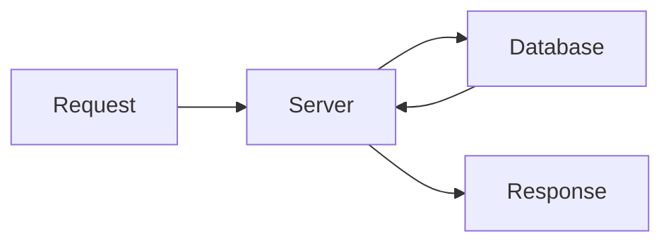

# prev-cli

A zero-config documentation site generator. Write markdown files, run `prev`, get a professional documentation website.

## The Problem

Setting up documentation sites typically requires:

- Choosing and configuring a static site generator
- Setting up a build toolchain (Webpack, Vite, etc.)
- Designing navigation and sidebar structures
- Configuring routing between pages
- Adding syntax highlighting for code blocks
- Implementing dark mode
- Making diagrams work

prev-cli eliminates all of this. Point it at a directory of markdown files and you have a documentation site.

## Installation

```bash
npm install -g prev-cli
# or
bun install -g prev-cli
```

## Quick Start

```bash
# Create a docs directory with some markdown
mkdir docs
echo "# Welcome\n\nThis is my documentation." > docs/index.md

# Start the dev server
prev

# Your docs are now live at http://localhost:3000
```

## Use Cases

### API Documentation

Organize your API docs by resource:

```
docs/
  index.md
  authentication.md
  api/
    users.md
    products.md
    orders.md
```

prev automatically generates a sidebar matching your file structure. No configuration needed.

### Product Documentation

Structure guides and tutorials naturally:

```
docs/
  index.md
  getting-started/
    installation.md
    quick-start.md
    configuration.md
  guides/
    basic-usage.md
    advanced-features.md
  reference/
    api.md
    configuration.md
```

### Internal Knowledge Base

Company documentation, runbooks, and procedures:

```
docs/
  index.md
  engineering/
    onboarding.md
    architecture.md
    deployment.md
  operations/
    runbooks/
      incident-response.md
      database-recovery.md
```

### Open Source Project Docs

Simple structure for project documentation:

```
docs/
  index.md
  installation.md
  usage.md
  contributing.md
  changelog.md
```

## Features

### MDX Support

Write React components directly in your markdown:

```mdx
# Getting Started

import { Button, Card } from '@prev/ui'

<Card>
  <p>Interactive documentation with components.</p>
  <Button>Try it out</Button>
</Card>
```

### Mermaid Diagrams

Include diagrams with standard markdown code blocks:

````markdown

````

Diagrams render client-side with intelligent caching for performance.

### D2 Diagrams

Architectural diagrams using D2 syntax:

````markdown
```d2
client -> server: request
server -> db: query
db -> server: results
server -> client: response
```
````

### Dark Mode

Built-in light/dark mode toggle that persists across sessions. No configuration required.

### Hot Module Replacement

Edit markdown files and see changes instantly in your browser during development.

### Built-in Components

Use the included component library without additional setup:

```mdx
import { Button, Card, CardHeader, CardTitle, CardContent } from '@prev/ui'

<Card>
  <CardHeader>
    <CardTitle>Feature Overview</CardTitle>
  </CardHeader>
  <CardContent>
    <p>Your content here.</p>
    <Button>Learn More</Button>
  </CardContent>
</Card>
```

## CLI Commands

### Development

```bash
prev              # Start dev server in current directory
prev dev          # Same as above
prev dev -p 4000  # Use specific port
prev -c ./docs    # Use different directory
```

### Production Build

```bash
prev build        # Build static site to ./dist
prev preview      # Preview the built site locally
prev preview -p 5000
```

### Maintenance

```bash
prev clean        # Remove cache directories older than 30 days
prev clean -d 7   # Remove caches older than 7 days
```

## File Conventions

### Frontmatter

Use YAML frontmatter to set page metadata:

```markdown
---
title: User Authentication
description: How to authenticate users in your application
---

Content here...
```

Supported frontmatter fields:

| Field | Type | Description |
|-------|------|-------------|
| `title` | string | Page title (overrides H1 heading) |
| `description` | string | Page description for metadata |

Custom fields are also preserved and accessible in the page data.

### Page Titles

Titles are resolved in this order:

1. `title` field in frontmatter
2. First H1 heading in the content
3. Directory name (for index/README files)
4. Filename (capitalized, hyphens become spaces)

### Index Pages

Both `index.md` and `README.md` are treated as index pages:

```
docs/
  README.md          -> /        (or index.md)
  guide/
    README.md        -> /guide   (or index.md)
    setup.md         -> /guide/setup
```

When both exist in the same directory, `index.md` takes precedence over `README.md`.

### Directory Structure

Directories become sidebar sections. Files within directories become pages:

```
docs/
  index.md          -> /
  setup.md          -> /setup
  guides/
    basic.md        -> /guides/basic
    advanced.md     -> /guides/advanced
```

### Supported Extensions

- `.md` - Standard markdown
- `.mdx` - Markdown with JSX support

## Requirements

- Node.js 18 or higher
- Works with npm, yarn, pnpm, or bun

## Why prev-cli?

| Concern | Traditional Tools | prev-cli |
|---------|-------------------|----------|
| Configuration | Multiple config files | None |
| Setup time | Hours | Minutes |
| Navigation | Manual routing | Automatic from file structure |
| Dark mode | Add a library | Built-in |
| Diagrams | Install plugins | Built-in |
| Components | Bring your own | Included |
| Learning curve | Steep | Minimal |

prev-cli is for teams that want documentation, not a documentation project.
