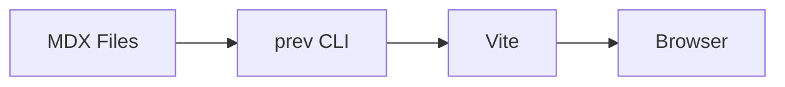

# prev CLI Implementation Plan

> **For Claude:** REQUIRED SUB-SKILL: Use superpowers:executing-plans to implement this plan task-by-task.

**Goal:** Build a zero-config documentation site CLI that transforms a directory of MDX files into a live website with shadcn components.

**Architecture:** CLI starts Vite programmatically, uses virtual modules to auto-generate routes from file structure, bundles shadcn/ui components as `@prev/ui`, renders MDX with mermaid support.

**Tech Stack:** Node.js, Vite, React, Tailwind CSS, MDX, shadcn/ui, mermaid

---

### Task 1: Project Setup & Dependencies

**Files:**
- Modify: `package.json`
- Create: `tsconfig.json` (replace existing)
- Create: `src/cli.ts`

**Step 1: Update package.json with dependencies**

```json
{
  "name": "prev-cli",
  "version": "0.1.0",
  "type": "module",
  "bin": {
    "prev": "./dist/cli.js"
  },
  "scripts": {
    "build": "tsc",
    "dev": "tsc --watch",
    "test": "bun test"
  },
  "dependencies": {
    "vite": "^6.0.0",
    "@vitejs/plugin-react": "^4.3.0",
    "@tailwindcss/vite": "^4.0.0",
    "tailwindcss": "^4.0.0",
    "@mdx-js/rollup": "^3.0.0",
    "remark-gfm": "^4.0.0",
    "rehype-highlight": "^7.0.0",
    "rehype-mermaid": "^3.0.0",
    "fast-glob": "^3.3.0",
    "react": "^19.0.0",
    "react-dom": "^19.0.0",
    "react-router-dom": "^7.0.0",
    "clsx": "^2.1.0",
    "tailwind-merge": "^2.5.0",
    "class-variance-authority": "^0.7.0",
    "lucide-react": "^0.460.0"
  },
  "devDependencies": {
    "@types/node": "^22.0.0",
    "@types/react": "^19.0.0",
    "@types/react-dom": "^19.0.0",
    "typescript": "^5.7.0"
  }
}
```

**Step 2: Update tsconfig.json**

```json
{
  "compilerOptions": {
    "target": "ES2022",
    "module": "ESNext",
    "moduleResolution": "bundler",
    "esModuleInterop": true,
    "strict": true,
    "skipLibCheck": true,
    "declaration": true,
    "outDir": "./dist",
    "rootDir": "./src",
    "jsx": "react-jsx"
  },
  "include": ["src/**/*"],
  "exclude": ["node_modules", "dist"]
}
```

**Step 3: Create minimal CLI entry**

```ts
// src/cli.ts
#!/usr/bin/env node
console.log('prev cli - not implemented yet')
```

**Step 4: Install dependencies**

Run: `bun install`
Expected: Dependencies installed successfully

**Step 5: Commit**

```bash
git add package.json tsconfig.json src/cli.ts bun.lock
git commit -m "chore: project setup with dependencies"
```

---

### Task 2: Cache Utilities

**Files:**
- Create: `src/utils/cache.ts`
- Create: `src/utils/cache.test.ts`

**Step 1: Write failing tests for cache utilities**

```ts
// src/utils/cache.test.ts
import { test, expect, beforeEach, afterEach } from 'bun:test'
import { getCacheDir, cleanCache } from './cache'
import { mkdir, rm, writeFile } from 'fs/promises'
import path from 'path'
import os from 'os'

const testCacheRoot = path.join(os.tmpdir(), 'prev-test-cache')

beforeEach(async () => {
  await mkdir(testCacheRoot, { recursive: true })
})

afterEach(async () => {
  await rm(testCacheRoot, { recursive: true, force: true })
})

test('getCacheDir returns consistent hash for same path and branch', async () => {
  const dir1 = await getCacheDir('/test/path', 'main')
  const dir2 = await getCacheDir('/test/path', 'main')
  expect(dir1).toBe(dir2)
})

test('getCacheDir returns different hash for different branches', async () => {
  const dir1 = await getCacheDir('/test/path', 'main')
  const dir2 = await getCacheDir('/test/path', 'feature')
  expect(dir1).not.toBe(dir2)
})

test('getCacheDir returns different hash for different paths', async () => {
  const dir1 = await getCacheDir('/test/path1', 'main')
  const dir2 = await getCacheDir('/test/path2', 'main')
  expect(dir1).not.toBe(dir2)
})

test('cleanCache removes directories older than maxAgeDays', async () => {
  const oldDir = path.join(testCacheRoot, 'old-cache')
  const newDir = path.join(testCacheRoot, 'new-cache')

  await mkdir(oldDir, { recursive: true })
  await mkdir(newDir, { recursive: true })

  // Set old dir mtime to 40 days ago
  const oldTime = new Date(Date.now() - 40 * 24 * 60 * 60 * 1000)
  await writeFile(path.join(oldDir, '.marker'), '')

  const removed = await cleanCache({ maxAgeDays: 30, cacheRoot: testCacheRoot })
  expect(removed).toBeGreaterThanOrEqual(0)
})
```

**Step 2: Run tests to verify they fail**

Run: `bun test src/utils/cache.test.ts`
Expected: FAIL with "Cannot find module './cache'"

**Step 3: Implement cache utilities**

```ts
// src/utils/cache.ts
import { createHash } from 'crypto'
import { readdir, rm, stat, mkdir } from 'fs/promises'
import { exec } from 'child_process'
import { promisify } from 'util'
import path from 'path'
import os from 'os'

const execAsync = promisify(exec)

const DEFAULT_CACHE_ROOT = path.join(os.homedir(), '.cache/prev')

export async function getCacheDir(rootDir: string, branch?: string): Promise<string> {
  const resolvedBranch = branch ?? await getCurrentBranch(rootDir)
  const hash = createHash('sha1')
    .update(`${rootDir}:${resolvedBranch}`)
    .digest('hex')
    .slice(0, 12)

  return path.join(DEFAULT_CACHE_ROOT, hash)
}

export async function getCurrentBranch(rootDir: string): Promise<string> {
  try {
    const { stdout } = await execAsync('git branch --show-current', { cwd: rootDir })
    return stdout.trim() || 'detached'
  } catch {
    return 'no-git'
  }
}

export async function cleanCache(options: {
  maxAgeDays: number
  cacheRoot?: string
}): Promise<number> {
  const cacheRoot = options.cacheRoot ?? DEFAULT_CACHE_ROOT
  const maxAge = options.maxAgeDays * 24 * 60 * 60 * 1000
  const now = Date.now()

  let dirs: string[]
  try {
    dirs = await readdir(cacheRoot)
  } catch {
    return 0
  }

  let removed = 0

  for (const dir of dirs) {
    const fullPath = path.join(cacheRoot, dir)
    try {
      const info = await stat(fullPath)
      if (info.isDirectory() && now - info.mtimeMs > maxAge) {
        await rm(fullPath, { recursive: true })
        removed++
      }
    } catch {
      // Skip if stat fails
    }
  }

  return removed
}

export async function ensureCacheDir(rootDir: string): Promise<string> {
  const cacheDir = await getCacheDir(rootDir)
  await mkdir(cacheDir, { recursive: true })
  return cacheDir
}
```

**Step 4: Run tests to verify they pass**

Run: `bun test src/utils/cache.test.ts`
Expected: All tests PASS

**Step 5: Commit**

```bash
git add src/utils/cache.ts src/utils/cache.test.ts
git commit -m "feat: add cache utilities with cleanup"
```

---

### Task 3: Port Utilities

**Files:**
- Create: `src/utils/port.ts`
- Create: `src/utils/port.test.ts`

**Step 1: Write failing tests for port utilities**

```ts
// src/utils/port.test.ts
import { test, expect } from 'bun:test'
import { getRandomPort, isPortAvailable } from './port'

test('getRandomPort returns a number in valid range', async () => {
  const port = await getRandomPort()
  expect(port).toBeGreaterThanOrEqual(3000)
  expect(port).toBeLessThanOrEqual(65535)
})

test('getRandomPort returns different ports on subsequent calls', async () => {
  const port1 = await getRandomPort()
  const port2 = await getRandomPort()
  // They might be the same by chance, but usually different
  expect(typeof port1).toBe('number')
  expect(typeof port2).toBe('number')
})

test('isPortAvailable returns boolean', async () => {
  const available = await isPortAvailable(59999)
  expect(typeof available).toBe('boolean')
})
```

**Step 2: Run tests to verify they fail**

Run: `bun test src/utils/port.test.ts`
Expected: FAIL with "Cannot find module './port'"

**Step 3: Implement port utilities**

```ts
// src/utils/port.ts
import { createServer } from 'net'

export async function getRandomPort(minPort = 3000, maxPort = 9000): Promise<number> {
  const port = Math.floor(Math.random() * (maxPort - minPort + 1)) + minPort

  if (await isPortAvailable(port)) {
    return port
  }

  // If random port not available, find next available
  return findAvailablePort(minPort, maxPort)
}

export function isPortAvailable(port: number): Promise<boolean> {
  return new Promise((resolve) => {
    const server = createServer()

    server.once('error', () => {
      resolve(false)
    })

    server.once('listening', () => {
      server.close()
      resolve(true)
    })

    server.listen(port, '127.0.0.1')
  })
}

async function findAvailablePort(minPort: number, maxPort: number): Promise<number> {
  for (let port = minPort; port <= maxPort; port++) {
    if (await isPortAvailable(port)) {
      return port
    }
  }
  throw new Error(`No available port found between ${minPort} and ${maxPort}`)
}
```

**Step 4: Run tests to verify they pass**

Run: `bun test src/utils/port.test.ts`
Expected: All tests PASS

**Step 5: Commit**

```bash
git add src/utils/port.ts src/utils/port.test.ts
git commit -m "feat: add port utilities"
```

---

### Task 4: Pages Scanner (Virtual Module Data)

**Files:**
- Create: `src/vite/pages.ts`
- Create: `src/vite/pages.test.ts`

**Step 1: Write failing tests for pages scanner**

```ts
// src/vite/pages.test.ts
import { test, expect, beforeEach, afterEach } from 'bun:test'
import { scanPages, fileToRoute, buildSidebarTree } from './pages'
import { mkdir, rm, writeFile } from 'fs/promises'
import path from 'path'
import os from 'os'

const testDir = path.join(os.tmpdir(), 'prev-pages-test')

beforeEach(async () => {
  await mkdir(testDir, { recursive: true })
})

afterEach(async () => {
  await rm(testDir, { recursive: true, force: true })
})

test('fileToRoute converts index.mdx to /', () => {
  expect(fileToRoute('index.mdx')).toBe('/')
})

test('fileToRoute converts guide/intro.mdx to /guide/intro', () => {
  expect(fileToRoute('guide/intro.mdx')).toBe('/guide/intro')
})

test('fileToRoute converts guide/index.mdx to /guide', () => {
  expect(fileToRoute('guide/index.mdx')).toBe('/guide')
})

test('scanPages finds all mdx files', async () => {
  await writeFile(path.join(testDir, 'index.mdx'), '# Home')
  await mkdir(path.join(testDir, 'guide'), { recursive: true })
  await writeFile(path.join(testDir, 'guide', 'intro.mdx'), '# Intro')

  const pages = await scanPages(testDir)

  expect(pages.length).toBe(2)
  expect(pages.map(p => p.route).sort()).toEqual(['/', '/guide/intro'])
})

test('buildSidebarTree creates nested structure', () => {
  const pages = [
    { route: '/', title: 'Home', file: 'index.mdx' },
    { route: '/guide', title: 'Guide', file: 'guide/index.mdx' },
    { route: '/guide/intro', title: 'Intro', file: 'guide/intro.mdx' },
  ]

  const tree = buildSidebarTree(pages)

  expect(tree.length).toBeGreaterThan(0)
})
```

**Step 2: Run tests to verify they fail**

Run: `bun test src/vite/pages.test.ts`
Expected: FAIL with "Cannot find module './pages'"

**Step 3: Implement pages scanner**

```ts
// src/vite/pages.ts
import { glob } from 'fast-glob'
import { readFile } from 'fs/promises'
import path from 'path'

export interface Page {
  route: string
  title: string
  file: string
}

export interface SidebarItem {
  title: string
  route?: string
  children?: SidebarItem[]
}

export function fileToRoute(file: string): string {
  const withoutExt = file.replace(/\.mdx?$/, '')

  if (withoutExt === 'index') {
    return '/'
  }

  if (withoutExt.endsWith('/index')) {
    return '/' + withoutExt.slice(0, -6)
  }

  return '/' + withoutExt
}

export async function scanPages(rootDir: string): Promise<Page[]> {
  const files = await glob('**/*.mdx', {
    cwd: rootDir,
    ignore: ['node_modules/**', 'dist/**', '.cache/**']
  })

  const pages: Page[] = []

  for (const file of files) {
    const fullPath = path.join(rootDir, file)
    const content = await readFile(fullPath, 'utf-8')
    const title = extractTitle(content, file)

    pages.push({
      route: fileToRoute(file),
      title,
      file
    })
  }

  return pages.sort((a, b) => a.route.localeCompare(b.route))
}

function extractTitle(content: string, file: string): string {
  const match = content.match(/^#\s+(.+)$/m)
  if (match) {
    return match[1].trim()
  }

  const basename = path.basename(file, path.extname(file))
  if (basename === 'index') {
    const dirname = path.dirname(file)
    return dirname === '.' ? 'Home' : capitalize(path.basename(dirname))
  }

  return capitalize(basename)
}

function capitalize(str: string): string {
  return str.charAt(0).toUpperCase() + str.slice(1).replace(/-/g, ' ')
}

export function buildSidebarTree(pages: Page[]): SidebarItem[] {
  const tree: SidebarItem[] = []
  const map = new Map<string, SidebarItem>()

  // Add root pages first
  for (const page of pages) {
    const segments = page.route.split('/').filter(Boolean)

    if (segments.length === 0) {
      tree.push({ title: page.title, route: page.route })
    } else if (segments.length === 1) {
      const item: SidebarItem = { title: page.title, route: page.route }
      map.set(segments[0], item)
      tree.push(item)
    } else {
      // Nested page
      const parentKey = segments[0]
      let parent = map.get(parentKey)

      if (!parent) {
        parent = { title: capitalize(parentKey), children: [] }
        map.set(parentKey, parent)
        tree.push(parent)
      }

      if (!parent.children) {
        parent.children = []
      }

      parent.children.push({ title: page.title, route: page.route })
    }
  }

  return tree
}
```

**Step 4: Run tests to verify they pass**

Run: `bun test src/vite/pages.test.ts`
Expected: All tests PASS

**Step 5: Commit**

```bash
git add src/vite/pages.ts src/vite/pages.test.ts
git commit -m "feat: add pages scanner for auto-routing"
```

---

### Task 5: Vite Config Factory

**Files:**
- Create: `src/vite/config.ts`

**Step 1: Implement Vite config factory**

```ts
// src/vite/config.ts
import type { InlineConfig } from 'vite'
import react from '@vitejs/plugin-react'
import tailwindcss from '@tailwindcss/vite'
import mdx from '@mdx-js/rollup'
import remarkGfm from 'remark-gfm'
import rehypeHighlight from 'rehype-highlight'
import rehypeMermaid from 'rehype-mermaid'
import path from 'path'
import { fileURLToPath } from 'url'
import { ensureCacheDir } from '../utils/cache'
import { pagesPlugin } from './plugins/pages-plugin'

const __dirname = path.dirname(fileURLToPath(import.meta.url))

export interface ConfigOptions {
  rootDir: string
  mode: 'development' | 'production'
  port?: number
}

export async function createViteConfig(options: ConfigOptions): Promise<InlineConfig> {
  const { rootDir, mode, port } = options
  const cacheDir = await ensureCacheDir(rootDir)

  return {
    root: rootDir,
    mode,
    cacheDir,

    plugins: [
      react(),
      tailwindcss(),
      mdx({
        remarkPlugins: [remarkGfm],
        rehypePlugins: [
          rehypeHighlight,
          [rehypeMermaid, { strategy: 'img-svg' }]
        ]
      }),
      pagesPlugin(rootDir)
    ],

    resolve: {
      alias: {
        '@prev/ui': path.join(__dirname, '../ui'),
        '@prev/theme': path.join(__dirname, '../theme')
      }
    },

    server: {
      port,
      strictPort: false
    },

    build: {
      outDir: path.join(rootDir, 'dist')
    }
  }
}
```

**Step 2: Commit**

```bash
git add src/vite/config.ts
git commit -m "feat: add vite config factory"
```

---

### Task 6: Pages Vite Plugin

**Files:**
- Create: `src/vite/plugins/pages-plugin.ts`

**Step 1: Implement pages plugin**

```ts
// src/vite/plugins/pages-plugin.ts
import type { Plugin } from 'vite'
import { scanPages, buildSidebarTree } from '../pages'

const VIRTUAL_MODULE_ID = 'virtual:prev-pages'
const RESOLVED_VIRTUAL_MODULE_ID = '\0' + VIRTUAL_MODULE_ID

export function pagesPlugin(rootDir: string): Plugin {
  return {
    name: 'prev-pages',

    resolveId(id) {
      if (id === VIRTUAL_MODULE_ID) {
        return RESOLVED_VIRTUAL_MODULE_ID
      }
    },

    async load(id) {
      if (id === RESOLVED_VIRTUAL_MODULE_ID) {
        const pages = await scanPages(rootDir)
        const sidebar = buildSidebarTree(pages)

        return `
          export const pages = ${JSON.stringify(pages)};
          export const sidebar = ${JSON.stringify(sidebar)};
        `
      }
    },

    handleHotUpdate({ file, server }) {
      if (file.endsWith('.mdx')) {
        const mod = server.moduleGraph.getModuleById(RESOLVED_VIRTUAL_MODULE_ID)
        if (mod) {
          server.moduleGraph.invalidateModule(mod)
          return [mod]
        }
      }
    }
  }
}
```

**Step 2: Commit**

```bash
git add src/vite/plugins/pages-plugin.ts
git commit -m "feat: add pages vite plugin for virtual module"
```

---

### Task 7: Theme Layout Component

**Files:**
- Create: `src/theme/Layout.tsx`
- Create: `src/theme/Sidebar.tsx`
- Create: `src/theme/styles.css`

**Step 1: Create Layout component**

```tsx
// src/theme/Layout.tsx
import React from 'react'
import { Outlet } from 'react-router-dom'
import { Sidebar } from './Sidebar'
import './styles.css'

export function Layout() {
  return (
    <div className="min-h-screen bg-background">
      <div className="flex">
        <Sidebar />
        <main className="flex-1 p-8 max-w-4xl">
          <article className="prose prose-neutral dark:prose-invert max-w-none">
            <Outlet />
          </article>
        </main>
      </div>
    </div>
  )
}
```

**Step 2: Create Sidebar component**

```tsx
// src/theme/Sidebar.tsx
import React from 'react'
import { Link, useLocation } from 'react-router-dom'
import { sidebar } from 'virtual:prev-pages'
import { cn } from '../ui/utils'

interface SidebarItem {
  title: string
  route?: string
  children?: SidebarItem[]
}

export function Sidebar() {
  const location = useLocation()

  return (
    <aside className="w-64 border-r border-border p-4 min-h-screen sticky top-0">
      <nav>
        <ul className="space-y-1">
          {(sidebar as SidebarItem[]).map((item, i) => (
            <SidebarItemComponent
              key={i}
              item={item}
              currentPath={location.pathname}
            />
          ))}
        </ul>
      </nav>
    </aside>
  )
}

function SidebarItemComponent({
  item,
  currentPath
}: {
  item: SidebarItem
  currentPath: string
}) {
  const isActive = item.route === currentPath

  if (item.children) {
    return (
      <li>
        <span className="font-semibold text-sm text-muted-foreground uppercase tracking-wide">
          {item.title}
        </span>
        <ul className="ml-3 mt-1 space-y-1">
          {item.children.map((child, i) => (
            <SidebarItemComponent
              key={i}
              item={child}
              currentPath={currentPath}
            />
          ))}
        </ul>
      </li>
    )
  }

  return (
    <li>
      <Link
        to={item.route || '/'}
        className={cn(
          'block py-1 px-2 rounded text-sm transition-colors',
          isActive
            ? 'bg-accent text-accent-foreground font-medium'
            : 'text-muted-foreground hover:text-foreground hover:bg-accent/50'
        )}
      >
        {item.title}
      </Link>
    </li>
  )
}
```

**Step 3: Create base styles**

```css
/* src/theme/styles.css */
@import "tailwindcss";

:root {
  --background: 0 0% 100%;
  --foreground: 0 0% 3.9%;
  --card: 0 0% 100%;
  --card-foreground: 0 0% 3.9%;
  --popover: 0 0% 100%;
  --popover-foreground: 0 0% 3.9%;
  --primary: 0 0% 9%;
  --primary-foreground: 0 0% 98%;
  --secondary: 0 0% 96.1%;
  --secondary-foreground: 0 0% 9%;
  --muted: 0 0% 96.1%;
  --muted-foreground: 0 0% 45.1%;
  --accent: 0 0% 96.1%;
  --accent-foreground: 0 0% 9%;
  --destructive: 0 84.2% 60.2%;
  --destructive-foreground: 0 0% 98%;
  --border: 0 0% 89.8%;
  --input: 0 0% 89.8%;
  --ring: 0 0% 3.9%;
  --radius: 0.5rem;
}

.dark {
  --background: 0 0% 3.9%;
  --foreground: 0 0% 98%;
  --card: 0 0% 3.9%;
  --card-foreground: 0 0% 98%;
  --popover: 0 0% 3.9%;
  --popover-foreground: 0 0% 98%;
  --primary: 0 0% 98%;
  --primary-foreground: 0 0% 9%;
  --secondary: 0 0% 14.9%;
  --secondary-foreground: 0 0% 98%;
  --muted: 0 0% 14.9%;
  --muted-foreground: 0 0% 63.9%;
  --accent: 0 0% 14.9%;
  --accent-foreground: 0 0% 98%;
  --destructive: 0 62.8% 30.6%;
  --destructive-foreground: 0 0% 98%;
  --border: 0 0% 14.9%;
  --input: 0 0% 14.9%;
  --ring: 0 0% 83.1%;
}

* {
  border-color: hsl(var(--border));
}

body {
  background-color: hsl(var(--background));
  color: hsl(var(--foreground));
}
```

**Step 4: Commit**

```bash
git add src/theme/Layout.tsx src/theme/Sidebar.tsx src/theme/styles.css
git commit -m "feat: add theme layout and sidebar components"
```

---

### Task 8: shadcn/ui Core Components

**Files:**
- Create: `src/ui/utils.ts`
- Create: `src/ui/button.tsx`
- Create: `src/ui/card.tsx`
- Create: `src/ui/index.ts`

**Step 1: Create utils**

```ts
// src/ui/utils.ts
import { type ClassValue, clsx } from 'clsx'
import { twMerge } from 'tailwind-merge'

export function cn(...inputs: ClassValue[]) {
  return twMerge(clsx(inputs))
}
```

**Step 2: Create Button component**

```tsx
// src/ui/button.tsx
import * as React from 'react'
import { cva, type VariantProps } from 'class-variance-authority'
import { cn } from './utils'

const buttonVariants = cva(
  'inline-flex items-center justify-center whitespace-nowrap rounded-md text-sm font-medium ring-offset-background transition-colors focus-visible:outline-none focus-visible:ring-2 focus-visible:ring-ring focus-visible:ring-offset-2 disabled:pointer-events-none disabled:opacity-50',
  {
    variants: {
      variant: {
        default: 'bg-primary text-primary-foreground hover:bg-primary/90',
        destructive: 'bg-destructive text-destructive-foreground hover:bg-destructive/90',
        outline: 'border border-input bg-background hover:bg-accent hover:text-accent-foreground',
        secondary: 'bg-secondary text-secondary-foreground hover:bg-secondary/80',
        ghost: 'hover:bg-accent hover:text-accent-foreground',
        link: 'text-primary underline-offset-4 hover:underline',
      },
      size: {
        default: 'h-10 px-4 py-2',
        sm: 'h-9 rounded-md px-3',
        lg: 'h-11 rounded-md px-8',
        icon: 'h-10 w-10',
      },
    },
    defaultVariants: {
      variant: 'default',
      size: 'default',
    },
  }
)

export interface ButtonProps
  extends React.ButtonHTMLAttributes<HTMLButtonElement>,
    VariantProps<typeof buttonVariants> {}

const Button = React.forwardRef<HTMLButtonElement, ButtonProps>(
  ({ className, variant, size, ...props }, ref) => {
    return (
      <button
        className={cn(buttonVariants({ variant, size, className }))}
        ref={ref}
        {...props}
      />
    )
  }
)
Button.displayName = 'Button'

export { Button, buttonVariants }
```

**Step 3: Create Card component**

```tsx
// src/ui/card.tsx
import * as React from 'react'
import { cn } from './utils'

const Card = React.forwardRef<
  HTMLDivElement,
  React.HTMLAttributes<HTMLDivElement>
>(({ className, ...props }, ref) => (
  <div
    ref={ref}
    className={cn(
      'rounded-lg border bg-card text-card-foreground shadow-sm',
      className
    )}
    {...props}
  />
))
Card.displayName = 'Card'

const CardHeader = React.forwardRef<
  HTMLDivElement,
  React.HTMLAttributes<HTMLDivElement>
>(({ className, ...props }, ref) => (
  <div
    ref={ref}
    className={cn('flex flex-col space-y-1.5 p-6', className)}
    {...props}
  />
))
CardHeader.displayName = 'CardHeader'

const CardTitle = React.forwardRef<
  HTMLParagraphElement,
  React.HTMLAttributes<HTMLHeadingElement>
>(({ className, ...props }, ref) => (
  <h3
    ref={ref}
    className={cn(
      'text-2xl font-semibold leading-none tracking-tight',
      className
    )}
    {...props}
  />
))
CardTitle.displayName = 'CardTitle'

const CardDescription = React.forwardRef<
  HTMLParagraphElement,
  React.HTMLAttributes<HTMLParagraphElement>
>(({ className, ...props }, ref) => (
  <p
    ref={ref}
    className={cn('text-sm text-muted-foreground', className)}
    {...props}
  />
))
CardDescription.displayName = 'CardDescription'

const CardContent = React.forwardRef<
  HTMLDivElement,
  React.HTMLAttributes<HTMLDivElement>
>(({ className, ...props }, ref) => (
  <div ref={ref} className={cn('p-6 pt-0', className)} {...props} />
))
CardContent.displayName = 'CardContent'

const CardFooter = React.forwardRef<
  HTMLDivElement,
  React.HTMLAttributes<HTMLDivElement>
>(({ className, ...props }, ref) => (
  <div
    ref={ref}
    className={cn('flex items-center p-6 pt-0', className)}
    {...props}
  />
))
CardFooter.displayName = 'CardFooter'

export { Card, CardHeader, CardFooter, CardTitle, CardDescription, CardContent }
```

**Step 4: Create barrel export**

```ts
// src/ui/index.ts
export { Button, buttonVariants } from './button'
export {
  Card,
  CardHeader,
  CardFooter,
  CardTitle,
  CardDescription,
  CardContent
} from './card'
export { cn } from './utils'
```

**Step 5: Commit**

```bash
git add src/ui/utils.ts src/ui/button.tsx src/ui/card.tsx src/ui/index.ts
git commit -m "feat: add shadcn/ui core components"
```

---

### Task 9: App Entry Point

**Files:**
- Create: `src/theme/App.tsx`
- Create: `src/theme/entry.tsx`

**Step 1: Create App component**

```tsx
// src/theme/App.tsx
import React from 'react'
import { BrowserRouter, Routes, Route } from 'react-router-dom'
import { Layout } from './Layout'
import { pages } from 'virtual:prev-pages'

// Dynamic imports for MDX pages
const pageModules = import.meta.glob('/**/*.mdx', { eager: true })

function getPageComponent(file: string) {
  const mod = pageModules[`/${file}`] as { default: React.ComponentType }
  return mod?.default
}

export function App() {
  return (
    <BrowserRouter>
      <Routes>
        <Route element={<Layout />}>
          {pages.map((page: { route: string; file: string }) => {
            const Component = getPageComponent(page.file)
            return Component ? (
              <Route
                key={page.route}
                path={page.route}
                element={<Component />}
              />
            ) : null
          })}
        </Route>
      </Routes>
    </BrowserRouter>
  )
}
```

**Step 2: Create entry point**

```tsx
// src/theme/entry.tsx
import React from 'react'
import { createRoot } from 'react-dom/client'
import { App } from './App'

const container = document.getElementById('root')
if (container) {
  const root = createRoot(container)
  root.render(<App />)
}
```

**Step 3: Commit**

```bash
git add src/theme/App.tsx src/theme/entry.tsx
git commit -m "feat: add app entry point with routing"
```

---

### Task 10: Vite Start/Build Commands

**Files:**
- Create: `src/vite/start.ts`

**Step 1: Implement start/build functions**

```ts
// src/vite/start.ts
import { createServer, build, preview } from 'vite'
import { createViteConfig } from './config'
import { getRandomPort } from '../utils/port'

export interface DevOptions {
  port?: number
}

export async function startDev(rootDir: string, options: DevOptions = {}) {
  const port = options.port ?? await getRandomPort()

  const config = await createViteConfig({
    rootDir,
    mode: 'development',
    port
  })

  const server = await createServer(config)
  await server.listen()

  console.log()
  console.log(`  prev dev server running at:`)
  server.printUrls()
  console.log()

  return server
}

export async function buildSite(rootDir: string) {
  const config = await createViteConfig({
    rootDir,
    mode: 'production'
  })

  await build(config)

  console.log()
  console.log(`  Build complete. Output in ./dist`)
  console.log()
}

export async function previewSite(rootDir: string, options: DevOptions = {}) {
  const port = options.port ?? await getRandomPort()

  const config = await createViteConfig({
    rootDir,
    mode: 'production',
    port
  })

  const server = await preview(config)

  console.log()
  console.log(`  Preview server running at:`)
  server.printUrls()
  console.log()

  return server
}
```

**Step 2: Commit**

```bash
git add src/vite/start.ts
git commit -m "feat: add vite start/build/preview commands"
```

---

### Task 11: CLI Implementation

**Files:**
- Modify: `src/cli.ts`

**Step 1: Implement full CLI**

```ts
// src/cli.ts
#!/usr/bin/env node
import { parseArgs } from 'util'
import { startDev, buildSite, previewSite } from './vite/start'
import { cleanCache } from './utils/cache'

const { values, positionals } = parseArgs({
  args: process.argv.slice(2),
  options: {
    port: { type: 'string', short: 'p' },
    days: { type: 'string', short: 'd' },
    help: { type: 'boolean', short: 'h' }
  },
  allowPositionals: true
})

const command = positionals[0] || 'dev'
const rootDir = process.cwd()

function printHelp() {
  console.log(`
prev - Zero-config documentation site generator

Usage:
  prev [command] [options]

Commands:
  dev       Start development server (default)
  build     Build for production
  preview   Preview production build
  clean     Remove old cache directories

Options:
  -p, --port <port>   Specify port (dev/preview)
  -d, --days <days>   Cache age threshold for clean (default: 30)
  -h, --help          Show this help message

Examples:
  prev                Start dev server on random port
  prev dev -p 3000    Start dev server on port 3000
  prev build          Build static site to ./dist
  prev clean          Remove caches older than 30 days
  prev clean -d 7     Remove caches older than 7 days
`)
}

async function main() {
  if (values.help) {
    printHelp()
    process.exit(0)
  }

  const port = values.port ? parseInt(values.port, 10) : undefined
  const days = values.days ? parseInt(values.days, 10) : 30

  try {
    switch (command) {
      case 'dev':
        await startDev(rootDir, { port })
        break

      case 'build':
        await buildSite(rootDir)
        break

      case 'preview':
        await previewSite(rootDir, { port })
        break

      case 'clean':
        const removed = await cleanCache({ maxAgeDays: days })
        console.log(`Removed ${removed} cache(s) older than ${days} days`)
        break

      default:
        console.error(`Unknown command: ${command}`)
        printHelp()
        process.exit(1)
    }
  } catch (error) {
    console.error('Error:', error instanceof Error ? error.message : error)
    process.exit(1)
  }
}

main()
```

**Step 2: Commit**

```bash
git add src/cli.ts
git commit -m "feat: implement full CLI with all commands"
```

---

### Task 12: HTML Template & Virtual Entry Plugin

**Files:**
- Create: `src/vite/plugins/entry-plugin.ts`

**Step 1: Implement entry plugin**

```ts
// src/vite/plugins/entry-plugin.ts
import type { Plugin } from 'vite'
import path from 'path'
import { fileURLToPath } from 'url'

const __dirname = path.dirname(fileURLToPath(import.meta.url))

const VIRTUAL_HTML_ID = 'virtual:prev-html'

export function entryPlugin(): Plugin {
  return {
    name: 'prev-entry',

    configureServer(server) {
      server.middlewares.use((req, res, next) => {
        if (req.url === '/' || !req.url?.includes('.')) {
          req.url = '/index.html'
        }
        next()
      })
    },

    resolveId(id) {
      if (id === 'index.html' || id === '/index.html') {
        return VIRTUAL_HTML_ID
      }
    },

    load(id) {
      if (id === VIRTUAL_HTML_ID) {
        const entryPath = path.join(__dirname, '../../theme/entry.tsx')

        return `
<!DOCTYPE html>
<html lang="en">
<head>
  <meta charset="UTF-8" />
  <meta name="viewport" content="width=device-width, initial-scale=1.0" />
  <title>Documentation</title>
</head>
<body>
  <div id="root"></div>
  <script type="module" src="${entryPath}"></script>
</body>
</html>
`
      }
    }
  }
}
```

**Step 2: Update vite config to include entry plugin**

Modify `src/vite/config.ts` to add `entryPlugin()` to plugins array.

**Step 3: Commit**

```bash
git add src/vite/plugins/entry-plugin.ts src/vite/config.ts
git commit -m "feat: add entry plugin for virtual HTML template"
```

---

### Task 13: TypeScript Declarations for Virtual Modules

**Files:**
- Create: `src/types/virtual.d.ts`

**Step 1: Create type declarations**

```ts
// src/types/virtual.d.ts
declare module 'virtual:prev-pages' {
  export interface Page {
    route: string
    title: string
    file: string
  }

  export interface SidebarItem {
    title: string
    route?: string
    children?: SidebarItem[]
  }

  export const pages: Page[]
  export const sidebar: SidebarItem[]
}

declare module '*.mdx' {
  const component: React.ComponentType
  export default component
}
```

**Step 2: Update tsconfig to include types**

Ensure `src/types` is included in tsconfig.json.

**Step 3: Commit**

```bash
git add src/types/virtual.d.ts tsconfig.json
git commit -m "feat: add typescript declarations for virtual modules"
```

---

### Task 14: Integration Test with Sample Docs

**Files:**
- Create: `test-docs/index.mdx`
- Create: `test-docs/guide/getting-started.mdx`

**Step 1: Create test documentation**

```mdx
{/* test-docs/index.mdx */}
# Welcome to Prev

This is a zero-config documentation site.

import { Button, Card, CardHeader, CardTitle, CardContent } from '@prev/ui'

<Card>
  <CardHeader>
    <CardTitle>Quick Start</CardTitle>
  </CardHeader>
  <CardContent>
    <p>Just run `prev` in your docs directory.</p>
    <Button>Get Started</Button>
  </CardContent>
</Card>

## Features

- Auto-generated sidebar from file structure
- MDX support with React components
- Mermaid diagrams
- shadcn/ui components built-in
```

```mdx
{/* test-docs/guide/getting-started.mdx */}
# Getting Started

## Installation

```bash
npm install -g prev-cli
```

## Usage

```bash
cd your-docs-folder
prev
```

## Architecture


```

**Step 2: Test manually**

Run: `bun run src/cli.ts` from test-docs directory
Expected: Dev server starts, site renders with sidebar

**Step 3: Commit**

```bash
git add test-docs/
git commit -m "test: add sample documentation for testing"
```

---

### Task 15: Final Cleanup & Build Verification

**Step 1: Run full build**

Run: `bun run build`
Expected: TypeScript compiles without errors

**Step 2: Run all tests**

Run: `bun test`
Expected: All tests pass

**Step 3: Test CLI globally**

Run: `npm link && cd test-docs && prev`
Expected: Dev server starts successfully

**Step 4: Final commit**

```bash
git add -A
git commit -m "chore: finalize build and verify functionality"
```

---

## Summary

This plan implements the `prev` CLI with:
- 15 tasks covering all components
- TDD approach for utilities
- Incremental commits after each task
- Integration test with sample docs

Ready for execution.
