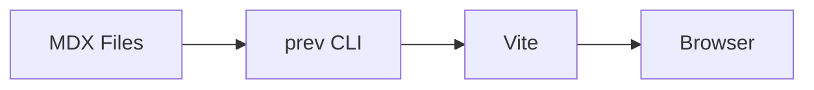

# Getting Started

## Installation

```bash
npm install -g prev-cli
```

## Usage

```bash
cd your-docs-folder
prev
```

## Architecture


```mermaid
graph LR
  A[MDX Files] --> B[prev CLI]
  B --> C[Vite]
  C --> D[Browser]
```
